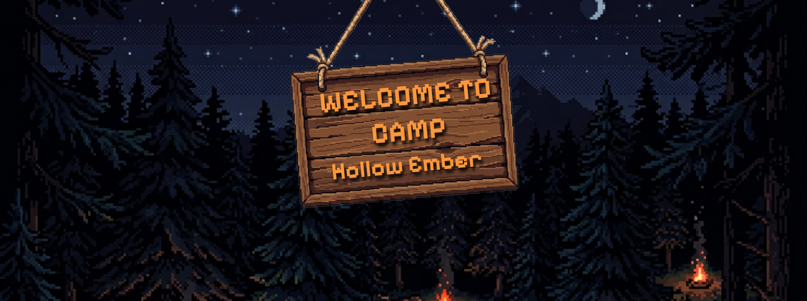
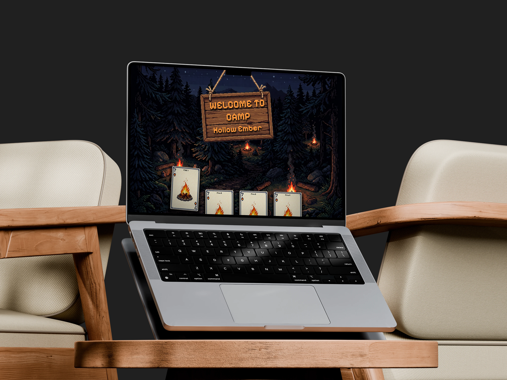

<!-- -->

<!-- # hollowEmber -->

<!-- REPLACE ALL THE [USERNAME] TEXT WITH YOUR GITHUB PROFILE NAME & THE [PROJECTNAME] WITH THE NAME OF YOUR GITHUB PROJECT -->

<!-- Repository Information & Links-->
<br />


<!-- HEADER SECTION -->
<h5 align="center" style="padding:0;margin:0;">Robert van Eijk</h5>
<h5 align="center" style="padding:0;margin:0;">251185</h5>
<h6 align="center">DV200</h6>
</br>
<p align="center">

  <a href="https://github.com/RobertvanEijk-OW-251185/hollowEmber">
    
  </a>
  
  <h3 align="center">Hollow Ember</h3>

  <p align="center">
    Share your thoughts by the fire! <br>
      <a href="https://github.com/RobertvanEijk-OW-251185/holoowEmber"><strong>Explore the docs »</strong></a>
   <br />
   <br />
   <a href="https://drive.google.com/file/d/1S4tPeVz3jmfLwv1Mk5I70p_ewfFjaIcK/view?usp=sharing">View Demo</a>
</p>
<!-- TABLE OF CONTENTS -->
## Table of Contents

* [About the Project](#about-the-project)
  * [Project Description](#project-description)
  * [Built With](#built-with)
* [Getting Started](#getting-started)
  * [Prerequisites](#prerequisites)
  * [How to install](#how-to-install)
* [Features and Functionality](#features-and-functionality)
* [Concept Process](#concept-process)
   * [Ideation](#ideation)
   * [Wireframes](#wireframes)
* [Development Process](#development-process)
   * [Implementation Process](#implementation-process)
        * [Highlights](#highlights)
        * [Challenges](#challenges)
   * [Reviews](#peer-reviews)
        * [Feedback from Reviews](#feedback-from-reviews)
   * [Future Implementation](#peer-reviews)
* [Final Outcome](#final-outcome)
    * [Mockups](#mockups)
    * [Video Demonstration](#video-demonstration)
* [Conclusion](#conclusion)
* [Roadmap](#roadmap)
* [Contributing](#contributing)
* [License](#license)
* [Contact](#contact)
* [Acknowledgements](#acknowledgements)

<!--PROJECT DESCRIPTION-->
## About the Project
<!-- header image of project -->



### Project Description

This project is a cozy, camp-style game designed to foster important conversations that won't be remembered by any system. Join a fire and the discussion to keep the burning flame going.

### Built With

* [XAMPP](path/to/technology/website)
* [PHP](path/to/technology/website)
* [MySQL](path/to/technology/website)
* [HTML](path/to/technology/website)
* [CSS](path/to/technology/website)
* [JavaScript](path/to/technology/website)

<!-- GETTING STARTED -->
<!-- Make sure to add appropriate information about what prerequisite technologies the user would need and also the steps to install your project on their own machines -->
## Getting Started

The following instructions will get a copy of the project up and running on your local machine for development and testing.

### Prerequisites

Ensure that you have the latest version of [XAMP](https://www.apachefriends.org/download.html) installed on your machine.

### How to install

### Installation
Here are a couple of ways to clone this repo:

1. Clone Repository </br>
Run the following in the command line to clone the project:
   ```sh
   git clone https://github.com/RobertvanEijk-OW-251185/hollowEmber.git
   ```
    Open `Software` and select `File | Open...` from the menu. Select the cloned directory and press the `Open` button

2. Run services in XAMPP Menu </br>
Run the following in the command line to install all the required dependencies:
   ```sh
   npm install
   ```

3. Open localhost server in Browser </br>
Paste the following URL into your browser to open the application:
   ```sh
   [npm install](http://localhost/hollowEmber/)
   ```


<!-- FEATURES AND FUNCTIONALITY-->
<!-- You can add the links to all of your imagery at the bottom of the file as references -->
## Features and Functionality

### Log In and Sign Up

Players are first introduced to the camp through the Logbook. From there, they can create an account, log in, and join the camp to begin their experience.


### Camp Select

After players have created their accounts and logged in, they will arrive at the Camp Select Menu. Here, they can choose a campfire to join and wait patiently for the session to fill with other players.


### Campfire Chat

After joining a campfire, players wait for the fire to fill to a maximum of 4 players. Then, a random topic is chosen from the database and assigned to the session. Only then does the Start Fire button become active, and any player can light the fire to begin the conversation. Through chatting, players earn scores for their messages and lose scores if they stop engaging. When the fire burns out, all chat communication ends, and players can either leave themselves or be removed after a 10-second waiting period.


<!-- CONCEPT PROCESS -->
<!-- Briefly explain your concept ideation process -->
## Concept Process

The `Conceptual Process` is the set of actions, activities, and research that were done when starting this project.

### Ideation


### Wireframes


<!-- DEVELOPMENT PROCESS -->
## Development Process

The `Development Process` is the technical implementation and functionality done in the frontend and backend of the application.

### Implementation Process
<!-- stipulate all of the functionality you included in the project -->

* Made use of both `functionality` to implement a specific feature.
* `MVC/MVVM` design architecture implemented.
* ETC.

#### Challenges
<!-- stipulate the challenges you faced with the project and why you think you faced them or how you think you'll solve them (if not solved) -->
* There was a bug with player leaving, where I made the system load the users into an array, and when users left the campfire session, it would only remove the last added user from that array, instead of removing that specific user.
* There was an issue with getting messages and user updates within the session to update accordingly on all screens, but this was fixed by changing my thinking method on what the structure should be regarding this functionality. On the original fix, it reloaded the entire document, replayed every animation from the beginning, and reset the timer. The fix was to create a POLLING function that polls and updates the specified information pulled through from the DB at a set interval and have that only update the information itself and not the entire page.
* There was an issue with getting the account creation working throughout, as I wanted ot make use of a Form, but using a Form in the HTML would break the layout. This was solved by using JS to get the form data from the input fields, create a new form with the user's typed-in information, and submit that form to the database.
* On the campfire's background animations, I struggled with linking them to the timer and getting the timer to function properly, as I haven't used animations or made a timer before. Initially, I made use of a switch to change the background animation based on the timer's display time, but had to later on change that as the timer I had to link through multiple DB tables for messages, start times, and end times. I ended up setting the animation after doing math from the DB in JS with const variables in a syncTimer function where it swaps between background animation states depending wither the time is more than 90 seconds left or less than 90 seconds left.

### Future Implementation
<!-- stipulate functionality and improvements that can be implemented in the future. -->

* Logbook entering animation.
* Logbook opening animation.
* Page-turning animation in the logbook.
* Log-Out Sign-Post that users can click on in the Camp Grounds to log them out.

<!-- MOCKUPS -->
## Final Outcome

### Mockups


<br>

<br>

<br>

<br>

<br>


<!-- VIDEO DEMONSTRATION -->
### Video Demonstration

To see a run-through of the application, click below:

[View Demonstration](https://drive.google.com/file/d/1S4tPeVz3jmfLwv1Mk5I70p_ewfFjaIcK/view?usp=sharing)

<!-- ROADMAP -->
## Roadmap

See the [open issues](https://github.com/username/projectname/issues) for a list of proposed features (and known issues).

<!-- CONTRIBUTING -->
## Contributing

Contributions are what make the open-source community such an amazing place to learn, inspire, and create. Any contributions you make are **greatly appreciated**.

1. Fork the Project
2. Create your Feature Branch (`git checkout -b feature/AmazingFeature`)
3. Commit your Changes (`git commit -m 'Add some AmazingFeature'`)
4. Push to the Branch (`git push origin feature/AmazingFeature`)
5. Open a Pull Request

<!-- AUTHORS -->
## Authors

* **Robert Connor van Eijk** - [RobertvanEijk-OW-251185](https://github.com/RobertvanEijk-OW-251185)

<!-- LICENSE -->
## License

Distributed under the MIT License. See `LICENSE` for more information.\

<!-- LICENSE -->
## Contact

* **Robert Connor van Eijk** - [251185@virtualwindow.co.za](mailto:251185@virtualwindow.co.za)
* **Project Link** - https://github.com/RobertvanEijk-OW-251185/hollowEmber

<!-- ACKNOWLEDGEMENTS -->
## Acknowledgements
<!-- all resources that you used and Acknowledgements here -->
* [Resource Name](path/to/resource)
* [Resource Name](path/to/resource)
* [Resource Name](path/to/resource)
* [Resource Name](path/to/resource)
* [Resource Name](path/to/resource)


<!-- MARKDOWN LINKS & IMAGES -->
[Banner]: assets/Mockups/Banner.png
[CampSelect]: assets/Mockups/CampSelect.png
[CampfireEnd]: assets/Mockups/CampfireEnd.png
[CampfireStart]: assets/Mockups/CampfireStart.png
[CampfrieMiddel]: assets/Mockups/CampfrieMiddel.png
[Ideation]: assets/Mockups/Ideation.png
[Login]: assets/Mockups/Login.png
[Signup]: assets/Mockups/Signup.png
[Wireframes]: assets/Mockups/Wireframes.png
[CampSelect]: assets/FeaturesImages/CampSelect.png
[CampSelectHover1]: assets/FeaturesImages/CampSelectHover1.png
[CampSelectHover3]: assets/FeaturesImages/CampSelectHover3.png
[CampfireRoom]: assets/FeaturesImages/CampfireRoom.png
[Login]: assets/FeaturesImages/Login.png
[Signup]: assets/FeaturesImages/Signup.png

